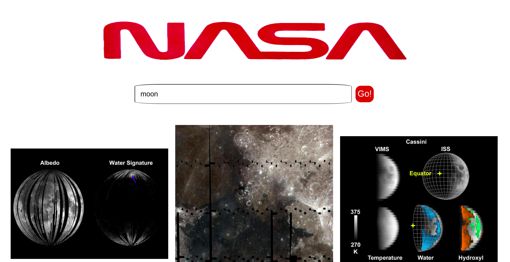

# React Technical Test

App allows users to search for images based on a query relating to space.
App utilises the NASA API endpoint:

GET​​ ​​https://images-api.nasa.gov/search ​Params: ​​q

## Functionality

- Search page which allows users to search for images by keyword
- Images are returned upon a successful search

## Images

## Building Process

### Built using

- React

### Testing utilities used

- Jest
- React Testing Library

### Packages Used:

- Axios
- PropTypes

## How to run the App:

After cloning the app using `git clone`
Run:
`$npm install` to install dependencies
`$npm test` to test the app
`$npm start` to run the app in the browser

## If I had more time...

- Make app more responsive for different types of mobile
- Add CSS animation to images when they load to make it more appealing visually

Author: Sara Cook
